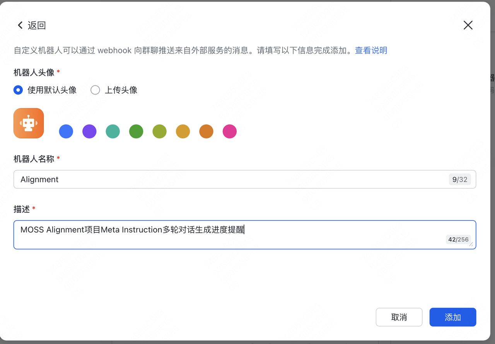
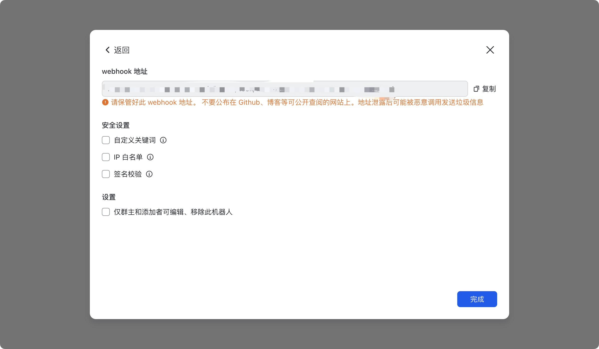
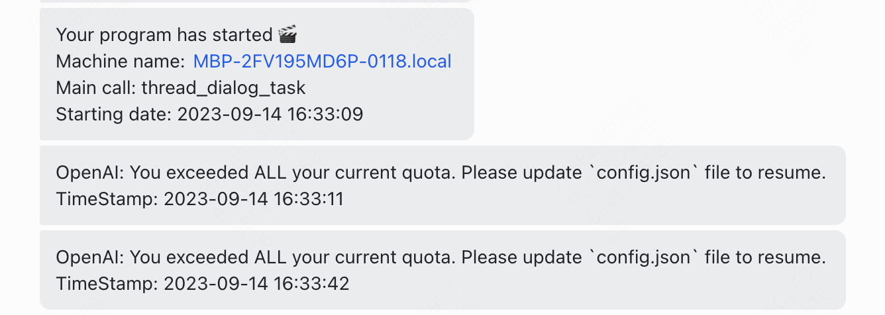

# GPTWrapper
## Introduction
这是一个包装GPT请求的迷你工具。`larknotice`实现代码执行完成或出错时飞书提示；`GPTWrapper`实现`GPT`请求封装

安装方法:
```sh
pip install -r requirements.txt
```

### larknotice
#### 前置条件
larknotice监听代码运行情况需要飞书创建一个群组（如果只想发给自己，可以不拉任何人来创建一个只包含自己的群组）

然后在群组设置-机器人里选择添加机器人-自定义机器人，你可以任意选定机器人的头像、名称、描述等，个人建议每个项目创建一个机器人，并在名称和描述里说明清楚该机器人为哪个项目服务，这样在收到消息时可以清楚知道应该去看哪个项目



添加后会得到一个webhook地址，请妥善保管此地址并不要暴露给他人，否则他人可以通过此url无限攻击你
你可以添加安全设置帮助自己避免被他人攻击，但我懒得保证这个的安全性就暂时没做



至此你就完成了机器人的添加

#### 监听进度
`larknotice.py`封装了一个用来发送通知的类，该类中你可以显式地输入hook_url，也即是上一节的**webhook地址**，或者传入为空，则会在环境变量中寻找`LARK_HOOK`变量
##### LarkBot
```python
class LarkBot:
    def __init__(self, hook_url=None) -> None:
        if hook_url is None:
            if 'LARK_HOOK' in os.environ:
            # 提取LARK_HOOK的值
                hook_url = os.environ['LARK_HOOK']
            else:
                raise ValueError('Failed to get Lark hook url. Add url to environment or pass it as an argument to class `LarkBot`.')
        self.hook_url = hook_url

    def send(self, content: str) -> None:
        """Send message `content` to `hook_url`
        """
```

##### lark_sender
同时还实现了一个函数lark_sender，会在你的程序执行前后或失败时向你发送通知，
```python
def lark_sender(webhook_url: str=None, content: str=None):
    """Lark sender wrapper: execute func, send a Lark notification with the end status
    (sucessfully finished or crashed) at the end. Also send a Lark notification before
    executing func.

    Args:
        webhook_url (str, optional): The webhook URL to access your lark robot. Defaults to None.
        content (str, optional): The message you want to send. Defaults to None.
    """
    bot = LarkBot(webhook_url)

    def decorator_sender(func):
        @functools.wraps(func)
        def wrapper_sender(*args, **kwargs):
            pass
        return wrapper_sender

    return decorator_sender
```
使用样例
###### lark_sender用法举例
```python
@lark_sender()
def train_your_model():
    import time
    time.sleep(10)
    return {'loss': 0.9}
```
###### LarkBot用法举例
```python
robot = LarkBot()
robot.send('hello world')
```


## GPTWrapper

GPTWrapper封装了请求`openai`的`ChatComplementions`和`Completions`的行为，同时包含多线程和多进程版本。
包含了对各种`OpenAIError`的处理逻辑，如果所有`api_key`均已用尽，则会阻塞程序并监听`config.json`的变化，直到`config.json`发生改变且依然符合JSON文件格式，则会重新尝试恢复请求。

### 使用样例
#### 单次GPT会话请求
```python
wrapper = GPTWrapper(
    config_path='./config.json',     # 存放api_key等信息的Config文件
    base_wait_time=30, # 该参数代表会在阻塞后每隔2**n*base_wait_time后发送通知并sleep
    lark_hook='xxxx'    # 机器人webhook地址
    )

# 单次请求会话
response = wrapper.completions_with_backoff(
    engine=engine, 
    messages=messages, 
    temperature=temperature, 
    max_tokens=max_tokens, 
    top_p=top_p, 
    frequency_penalty=frequency_penalty, 
    presence_penalty=presence_penalty,
    **kwargs    # other parameters to pass to gpt
)
```

#### 多进程数据处理
首先需要自定义一个数据处理函数，在这个函数中可以对数据进行处理，如进行多轮对话、正则匹配等等行为；然后使用GPTWrapper.multi_process_pipeline函数实现多进程数据处理

多线程版本与多进程版本一致，只需替换函数名即可

kwargs中可以设置lark_hook，即可实现飞书消息提示

```python

# 多进程请求会话
# 首先需要自定义一个数据处理函数，且保证前三个参数依次为:
# 1. pid: int 人为标识的进程id，与系统的pid无关(一般情况下用不到
# 2. wrapper: GPTWrapper 一个GPTWrapper实例
# 3. data_chunk: List[Any] 一批数据
# 
# args和kwargs可以自行指定
# 保证返回结果为一个List[Any]，对应各个数据样本的输出结果
def example_func(pid: int, wrapper: GPTWrapper, data_chunk: List[Any], *args, **kwargs):
    results = []
    for item in data_chunk:
        result = {}
        response = wrapper.completions_with_backoff(
            engine=kwargs.pop('model', 'gpt-4-0125-preview'),
            messages=[
                {
                    'role': 'system',
                    'content': item['system_prompt']
                },
                {
                    'role': 'system',
                    'content': item['prompt']
                }
            ],
            temperature=kwargs.pop('temperature', 0.7)
            **kwargs
            )
        result['response'] = response
        result['prompt'] = item['prompt']
        # result可以根据具体情况随意设置
        results.append(result)
    return results    # 确保最后返回的是一个List[Any]

# 使用GPTWrapper.multi_process_pipeline函数完成多进程任务
# 会根据process_num为每个进程分配一个GPTWrapper实例，并在进程
results = GPTWrapper.multi_process_pipeline(
    config_path=config_path,
    process_num=process_num,
    data=data,
    func=example_func,
    kwargs=kwargs
    )
```

        
#### 单轮对话多进程数据处理
针对最简单的情况实现了一个简单的版本，仅需传入`system_prompts`和`prompts`即可自动请求GPT并得出回复，将最终结果保存至`fout`中。对于每个线程产生的数据，会先暂存至`worker{tid}_{fout}`中。若程序被中断，下次重新启动时会读取临时文件，并恢复至上一次中断的位置继续执行。
    
```python
GPTWrapper.single_round_multi_thread(
    config_path=config_path,
    engine=model,
    threads_num=threads_num,
    system_prompts=system_prompts,    # 使用的system_prompts，需要为List，且长度与prompts一致； 如不需要system_prompt，可以简单设置为[None] * len(prompts)
    prompts=prompts,
    fout=fout,    # 输出文件的路径，应为.jsonl文件
    **kwargs
    ) 
```